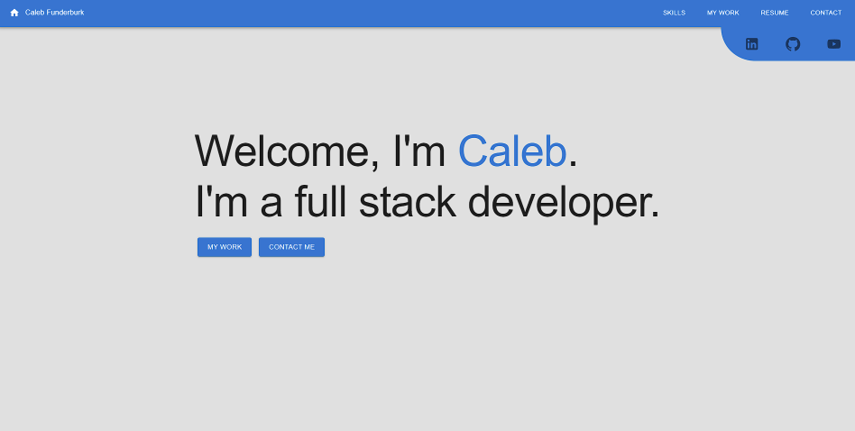
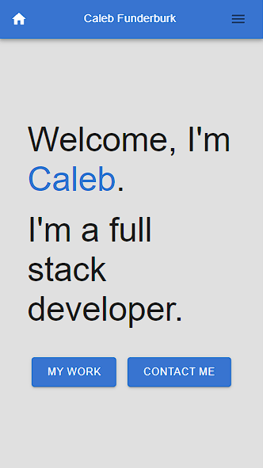

# React Portfolio

## About this App

### Description

The purpose of this project was to provide myself with a platform to showcase my work and experience as a developer.

### Features

* This project used React in order to build a single page application.
* MaterialUI was used for all of the front-end design.
* Utilized Vite for all production-level bundling.

### Built With

- Express
- Node.JS
- React
- MaterialUI
- Vite
- EmailJS
- CSS
- HTML
- JavaScript

## Deployed Application

<a href="https://calebfunderburk.github.io/Portfolio3.0/" target="_blank">Click here</a> to view this application.

## Installation

This program can be run through a browser using the above link to the deployed application. In order to run this program locally you will need to:

* Clone this repository to receive all the files.

## Screenshot

### Desktop

### Mobile

### Contributions

- Caleb Funderburk